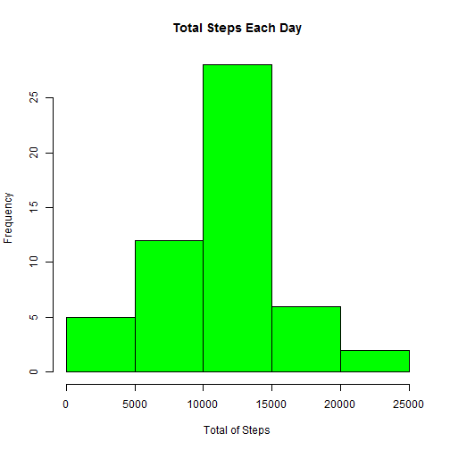
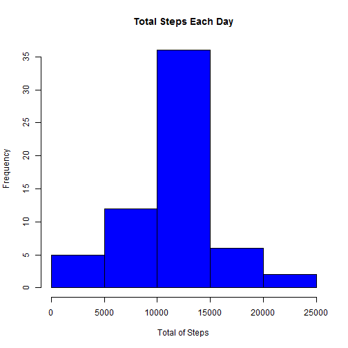

```r
---
title: "Exploratory Data Analysis - course project 1"
author: "Reinaldo Maciel"
date: "20 de julho de 2016"
output: html_document
---

==============================================================


<BR>
<BR>
<BR>
<BR>


#Loading the Data.
```

```
## Error: <text>:8:1: unexpected '=='
## 7: 
## 8: ==
##    ^
```

```r
# reading the file

if(!file.exists("getdata-projectfiles-UCI HAR Dataset.zip")) {
        tmp <- tempfile()
        download.file("http://d396qusza40orc.cloudfront.net/repdata%2Fdata%2Factivity.zip",tmp)
        unzip(tmp)
        unlink(tmp)
}

df <- read.csv("activity.csv")
```


<BR>
<BR>

# What is mean total number of steps taken per day?


```r
sum_steps <- aggregate(steps ~ date, df, sum)
hist(sum_steps$steps, main = paste("Total Steps Each Day"), col="green", xlab="Total of Steps")
```



### Calculate and report the mean and median of the total number of steps taken per day.


```r
print(paste("The mean is:", mean(sum_steps$steps), sep = " "))
```

```
## [1] "The mean is: 10766.1886792453"
```

```r
print(paste("The median is:", median(sum_steps$steps), sep = " "))
```

```
## [1] "The median is: 10765"
```


<BR>
<BR>

# What is the average daily activity pattern?

* Make a time series plot (i.e. type = "l") of the 5-minute interval (x-axis) and the average number of steps taken, averaged across all days (y-axis)

* Which 5-minute interval, on average across all the days in the dataset, contains the maximum number of steps?


```r
steps_by_interval <- aggregate(steps ~ interval, df, mean)

plot(steps_by_interval$interval,steps_by_interval$steps, type="l", xlab="Interval", ylab="Number of Steps",main="Average Number of Steps per Day by Interval")
```


```r
print(paste("The 5-minute interval with the maximum number of steps is:", steps_by_interval[which.max(steps_by_interval$steps),1], sep = " "))
```

```
## [1] "The 5-minute interval with the maximum number of steps is: 835"
```

<BR>
<BR>
<BR>
<BR>


# Imputing missing values

* Calculate and report the total number of missing values in the dataset (i.e. the total number of rows with NAs)

* Devise a strategy for filling in all of the missing values in the dataset. The strategy does not need to be sophisticated. For example, you could use the mean/median for that day, or the mean for that 5-minute interval, etc.

* Create a new dataset that is equal to the original dataset but with the missing data filled in.

* Make a histogram of the total number of steps taken each day and Calculate and report the mean and median total number of steps taken per day. Do these values differ from the estimates from the first part of the assignment? What is the impact of imputing missing data on the estimates of the total daily number of steps?


```r
print(paste("The total of missing data is: ", sum(!complete.cases(df)), sep = " "))
```

```
## [1] "The total of missing data is:  2304"
```


**_All of the missing values are filled in with mean value for that 5-minute interval._**


```r
stepsInterval <- aggregate(steps ~ interval, data = df, mean, na.rm = TRUE)
interval2steps <- function(interval) {
    stepsInterval[stepsInterval$interval == interval, ]$steps
}
```

**_Replace each missing value with the mean value of its 5-minute interval_**


```r
Filled <- df  # Make a new dataset with the original data
count = 0  # Count the number of data filled in
for (i in 1:nrow(Filled)) {
    if (is.na(Filled[i, ]$steps)) {
        Filled[i, ]$steps <- interval2steps(Filled[i, ]$interval)
        count = count + 1
    }
}
```


**_Now, using the filled data set, let's make a histogram of the total number of steps taken each day and calculate the mean and median total number of steps._**

```r
totalSteps2 <- aggregate(steps ~ date, data = Filled, sum)
hist(totalSteps2$steps, main = paste("Total Steps Each Day"), col="blue", xlab="Total of Steps")
```




```r
print(paste("This is the mean:", mean(totalSteps2$steps), sep = " "))
```

```
## [1] "This is the mean: 10766.1886792453"
```


```r
print(paste("This is the median:", median(totalSteps2$steps), sep = " "))
```

```
## [1] "This is the median: 10766.1886792453"
```

* Do these values differ from the estimates from the first part of the assignment? What is the impact of imputing missing data on the estimates of the total daily number of steps?

 The **mean** value is the same as the value before imputing missing data because we put the mean value for that particular 5-min interval. The median value shows a little difference : but it **depends on where the missing values are.**

<BR>
<BR>

**_Are there diferences in activity patterns between weekdays and weekends?_**

* Create a new factor variable in the dataset with two levels - "weekday" and "weekend" indicating whether a given date is a weekday or weekend day.


```r
Filled$day = ifelse(as.POSIXlt(as.Date(Filled$date))$wday%%6 == 
    0, "weekend", "weekday")
# For Sunday and Saturday : weekend, Other days : weekday
Filled$day = factor(Filled$day, levels = c("weekday", "weekend"))
```


* Make a panel plot containing a time series plot (i.e. type = "l") of the 5-minute interval (x-axis) and the average number of steps taken, averaged across all weekday days or weekend days (y-axis). The plot should look something like the following, which was creating using simulated data:


```r
library(lattice)
stepsInterval2 = aggregate(steps ~ interval + day, Filled, mean)
xyplot(steps ~ interval | factor(day), data = stepsInterval2, aspect = 1/2, type = "l")
```


```

